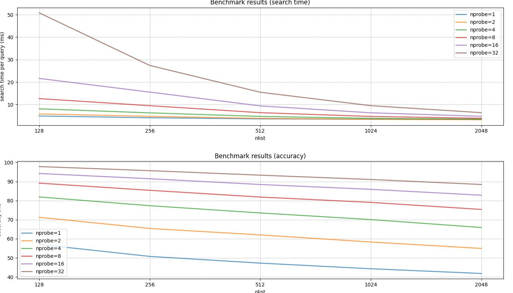

# Milvus Vector Database

[Milvus](https://milvus.io/) is a high performance vector database. This project demonstrates various optimization 
techniques for vector search including quantization, advanced indexing algorithms like Google's ScaNN, and GPU acceleration.


## Quick Start

### Create Python Environment
```bash
# Run the following command from anywhere within the milvus_vector_database project
pixi install

# Or run scripts directly (auto-installs the environment)
pixi run load_glove
```

### Basic Usage
```python
from milvus_vector_database.src.milvus_glove import MilvusGlove, OptimizationPreset

# Create client and load data
client = MilvusGlove(remote=False)
client.create_collection(overwrite=True)
# ... insert vectors ...

# Apply optimization
client.optimize_with_preset("scann")  # or "speed", "memory", "balanced"

# Search with optimization
results = client.search_vectors(query_vector, k=10)
```

### Start a Milvus service with docker
The lite version of Milvus allows for only a small subset of vector indexes. So if you want to use more
advanced indexing procedures like Google's scann, you'll have to use the remote variant.

#### Docker with CPU
In order to use the remote version of Milvus (instead of the Lite) version, use the 
`milvus_vector_database/docker/cpu/standalone_embed.sh` script to create a docker container with the Milvus vector database
running inside the container. More info can be found on [milvus with CPU docker](https://milvus.io/docs/install_standalone-docker.md).
Start the container with 
```bash
cd milvus_vector_database/docker/cpu/
./standalone_embed.sh start
```

#### Docker with GPU
Some [index types need GPU](https://milvus.io/api-reference/pymilvus/v2.6.x/MilvusClient/Collections/IndexType.md) to
work. The standard standalone version doesn't support GPU. For this you will need to use the GPU version of the docker
image. Detailed instructions can be found here: [milvus with GPU docker](https://milvus.io/docs/install_standalone-docker-compose-gpu.md).

Also note that standard Docker cannot use GPUs. You will also need to install a special toolkit from NVIDIA that acts as 
a bridge between Docker and your NVIDIA drivers. Follow the [NVIDIA Container Toolkit instructions](https://docs.nvidia.com/datacenter/cloud-native/container-toolkit/latest/install-guide.html)
and restart the docker daemon in the end.

Start the docker containers with
```bash
cd milvus_vector_database/docker/gpu/
sudo docker compose up
```

#### WebUI
Milvus also has a web user interface. To access the WebUI go to http://127.0.0.1:9091/webui/.

### Optional: monitoring stack
Additionally, you can also use prometheus with grafana and a custom disk usage exporter to monitor disk usage and
memory usage. Both can be interesting since indexes use both of these.

If all docker containers have been started (including the Milvus one), you can access the following links:
* Grafana: http://localhost:3000 (admin/admin)
* Prometheus: http://localhost:9090
* Custom Disk Exporter metrics: http://localhost:8000
* Milvus metrics: http://localhost:9091/metrics
* Milvus WebUI: http://127.0.0.1:9091/webui/

Note that Milvus creates three folders. Two of them are important:
* minio: stores all your data and index files. This part will have most of the disk usage.
* etcd: stores all the metadata. This disk usage is usually very small but can also be important.


## Benchmark Results

### Comparing different indexes
As part of the project, I wanted to run some benchmarks on various indexes. There's many things you can monitor when
benchmarking an index, like memory usage, CPU usage and more. But for this analysis, I only focused on speed and 
accuracy. In this first benchmark, I focused on different indexes with some default hyperparameters. To get more
info on which indexes the names in the plot refer to, I'd suggest to have a look at `milvus_vector_database/src/milvus/index_configuration.py`.


Some take-aways and notes from this plot:
* `accuracy` and `gpu_accuracy` both have 100% accuracy (or recall). This is expected as we're basically brute-forcing it.
* Note that `accuracy` takes more than 100ms per query (much more than the others), so I decided to crop it off of the plot.
* Nice to see that `gpu_accuracy` is almost 2 orders of magnitude faster than `accuracy` (I used an H100 GPU with 24GB of memory).
* Google's `scann` is the fastest of them all, however it does sacrifice quite some accuracy for low values of `k`.
* You can optimize for both memory usage and speed. The `balanced` approach tries to make sure we still use memory and are not the fastest,
  but as you can see it has some of the highest accuracies.

Note that all these conclusions are based on some default settings for the index and for the search. For sure, we can
optimize by tweaking both for all index types.

### Comparing different configurations of an index
I also wanted to just choose one index and play around with it. I decided to go with the `IVF_SQ8` index type because 
it's quite intuitive to configure and fast to evaluate. We will play around with the index configuration parameter
`nlist` and the search configuration parameter `nprobe`.



Some take-aways and notes from this plot:
* The higher `nlist`, the faster the search. Each cluster has a smaller number of samples, thus fewer samples to search 
  through and thus faster.
* The higher `nprobe`, the more accurate the search. We will search through more clusters, thus increasing the 
  probability of a closer match.
* Diving in deeper, looking at the brown line in the first plot: `nlist=128` and `nprobe=32`. The search time is very 
  slow; having 128 clusters and searching through 32 of them basically means we're searching through roughly 25% of 
  the data. This of course depends on the cluster sizes.
* Having a high `nlist` in combination with a high `nprobe` could be a good trade-off. With `nlist=2048` we see that 
  all search times roughly converge with high `nprobe`. However, accuracy is much higher. For example, let's compare
  `nlist=128` with `nprobe=4` (green line) and `nlist=2048` with `nprobe=32` (brown line). The latter has a lower time 
  per query, but has an accuracy of ~88% whereas the former has an accuracy of ~82%. Some quick maths tell us that the 
  former searches through twice as much data (2048/128 * 4/32 = 2) with a lower accuracy.
