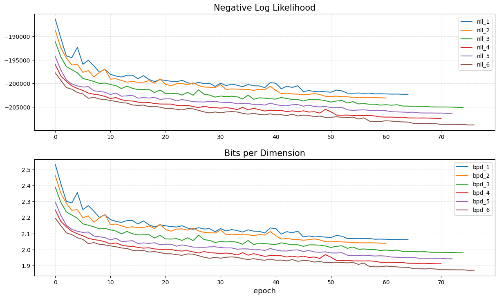
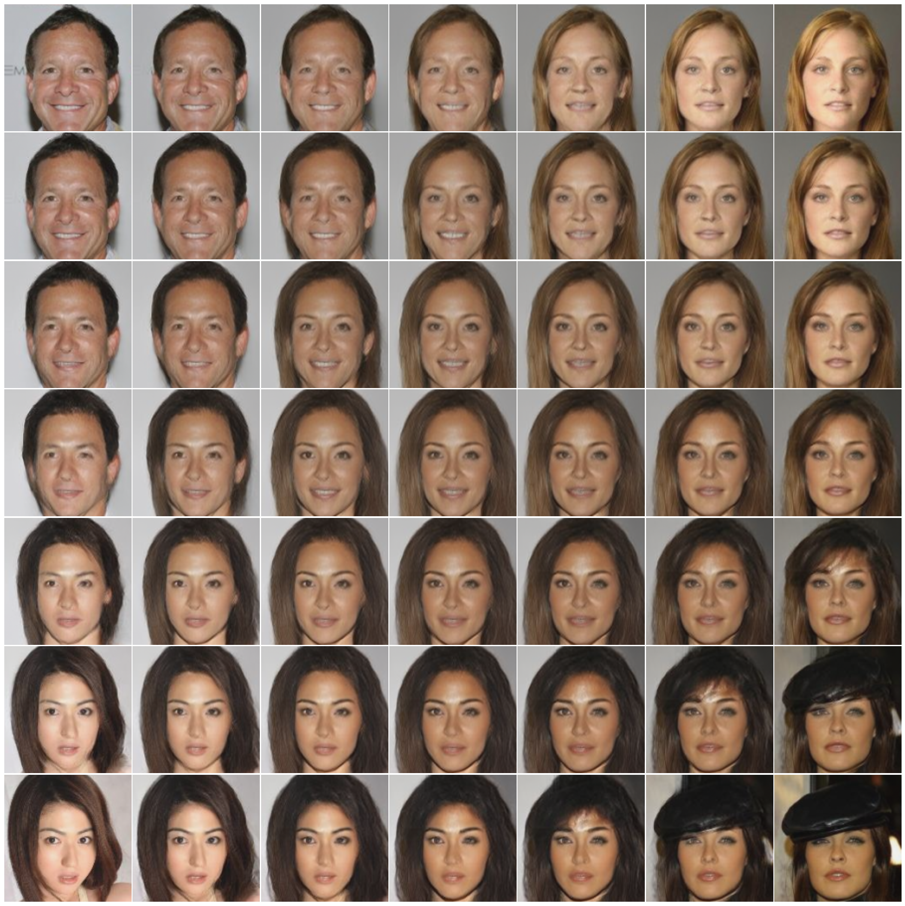

# Normalizing Flows

A normalizing flow allows you to map a complex data distribution (e.g. images) to a simpler one through 
bijective mappings. I found this video very helpful in understanding normalizing flows: 
["Normalizing Flows" by Didrik Nielsen](https://www.youtube.com/watch?v=bu9WZ0RFG0U)


## Create Python Environment
Create the python environment with the yaml file:
```shell
conda env create -f environment.yaml
```


## Train a model
Under the `scripts` folder, you can find a `train_celeba.py` script. In `config_train_celeba.yaml` you can choose to 
train a realnvp or a glow model. Configure it however you like.


## Experiments with glow models
As part of this topic, I wanted to train a couple of glow models to understand a bit how they work and if the trainings
would converge to something nice. I wanted to train on 128x128 sized celebA images. I trained the following glow models (which I'll name in order from glow_1 to glow_6).

| Nr Flow Steps | Hidden Dimension | Nr Model Parameters  |
|---------------|------------------|----------------------|
| 16            | 256              | 27,496,000           |
| 16            | 512              | 63,876,672           |
| 32            | 256              | 54,992,000           |
| 32            | 512              | 127,753,344          |
| 48            | 256              | 82,488,000           |
| 48            | 512              | 191,630,016          |

The metrics are shown in the following figure. Note that bits per dimension is completely determined based on the negative log-likelihood which is why the curves look the same. I could have left one of the plots out, but I thought I'd plot them both anyway.


Based on this figure, we see that doubling the number of steps is more important than doubling the hidden dimension.
We also see that the bigger the model, the better the results. Training glow_1 took some 17 hours. While
training glow_6 took some 152 hours on a H100 GPU (24GB of memory).

Below we'll focus on glow_6 for more detailed results. I did some latent space walk and made a gif of the progress of the generated images (based on fixed latent vectors).

Note that the generated faces hop quite a bit during the training. Only at the end of the training, it stabilizes. Likely that is because of the reduced learning rate.


Using some random images from the test set, I did some latent walk. It's interesting to see that the latent walk generates higher quality faces than generating them from scratch.

